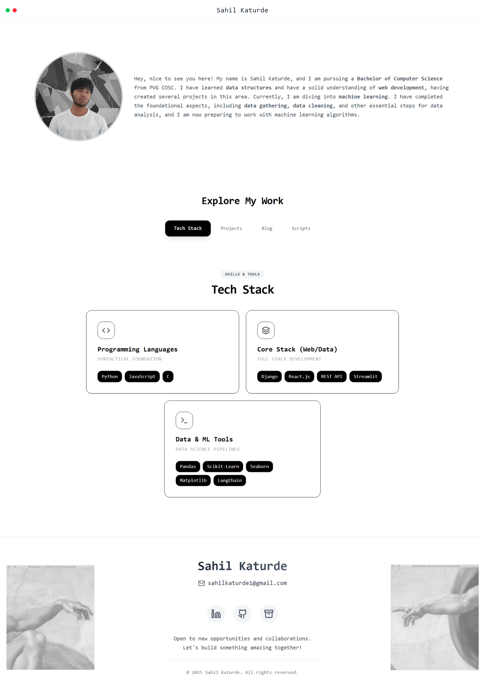
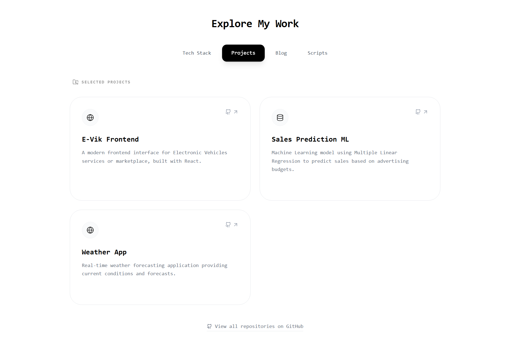
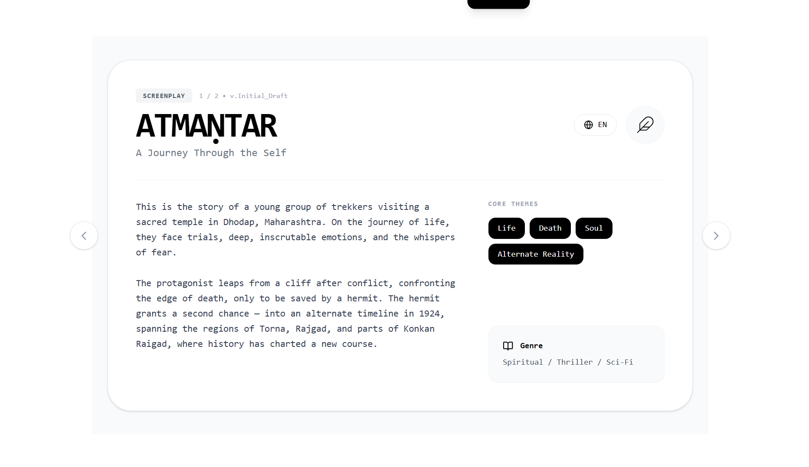
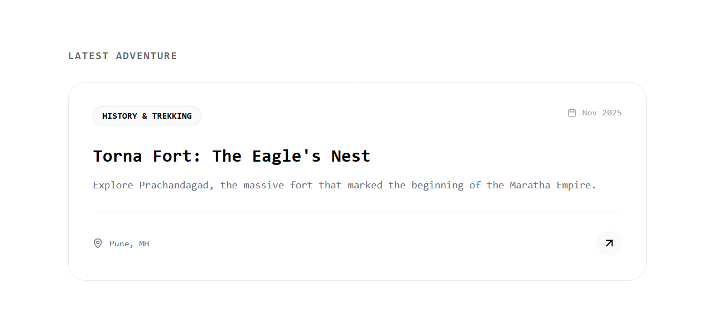

# Sahil’s Portfolio (React)

This repository contains my personal portfolio application built using **React**.  
The site supports **Marathi and English**, includes multiple tabs for navigation, and features a unique **dual-angle page** layout to display content in both languages clearly.

---

## 🖼 Main Page Layout



---

## 🚀 Features

- **Built with React**  
- **Dual Language Support** – Marathi & English  
- **Multiple Tabs** for better navigation (Home, Projects, Writing, Blog, etc.)  
- **Clean UI** designed for readability  
- **Dual-angle page** to present bilingual content side-by-side  
- **Additional screenshots** included below

---

## 📸 Additional Screenshots

### 📌 Project Page  


### ✍️ Writing Page  


### 📰 Blog Page  


---

## 🛠 Backend Information (Important)

I have created a **complete Django backend setup** for this portfolio, but I did **not include it here**.

**Reason:**  
As a student, I currently have financial constraints and some personal expenses, so I cannot host or maintain the backend right now.  
However, I have added some backend-related code that will be integrated in the future once hosting becomes possible.

When my budget allows, I will **add and deploy the full Django backend**.

---

## 📦 How to Run This Project

```bash
# Clone the repository
git clone https://github.com/SahilKaturde/Sahil-s-Portfolio.git

# Navigate into the project directory
cd Sahil-s-Portfolio

# Install dependencies
npm install
# or
yarn install

# Start the development server
npm start
# or
yarn start
